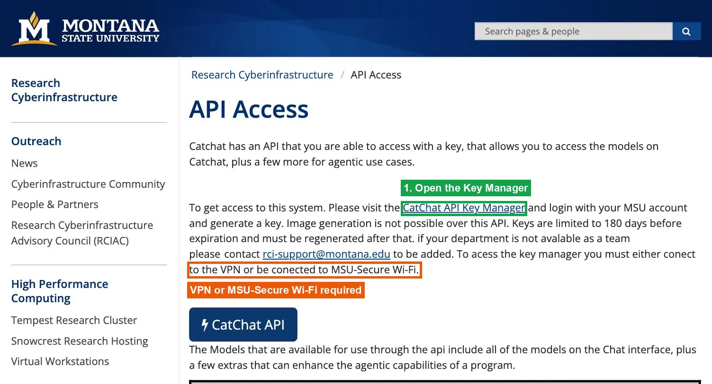
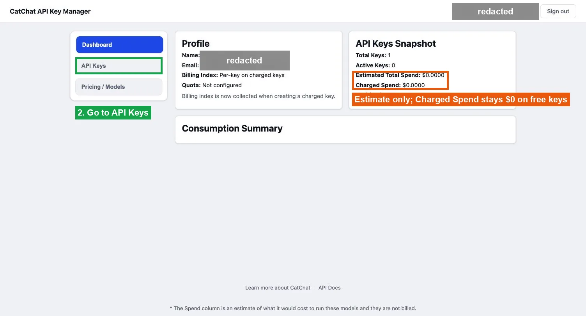
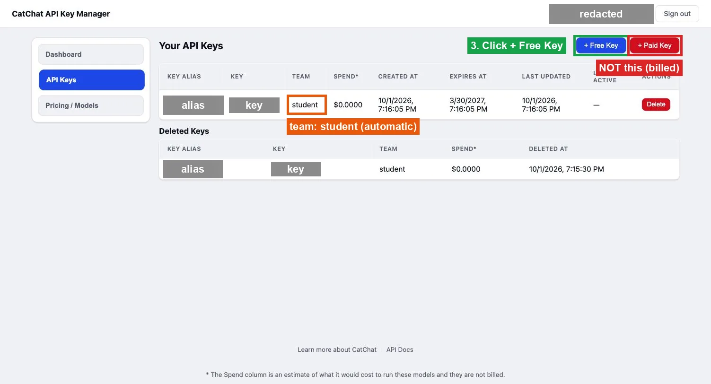
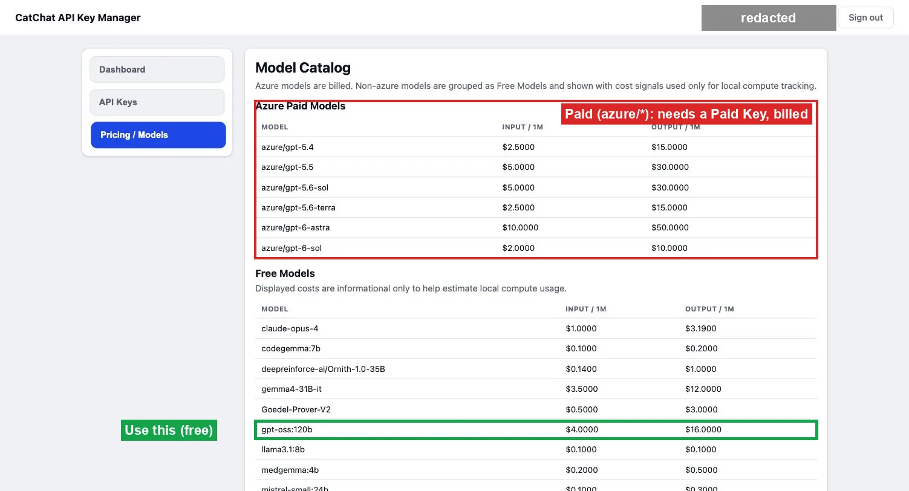

# Getting a Free CatChat API Key (MSU)

G2Fuzz uses MSU's CatChat API. It is free with a **Free Key**.
Official docs: [CatChat API Access](https://www.montana.edu/uit/rci/catchat/api-access.html).

Never commit or share your key. Each teammate makes their own.

## 1. Open the Key Manager

Connect to MSU-Secure Wi-Fi or the MSU VPN.
Open <https://catchat-access.msu.montana.edu/> and sign in with your MSU account.



## 2. Go to API Keys



Estimated spend is not billed. Charged Spend stays $0 on a free key.

## 3. Create a Free Key

Click **+ Free Key**. Do not use **+ Paid Key**; it is billed.
Copy the key right away. It is shown masked afterwards.



Keys expire after 180 days. Delete and recreate a key if it leaks.

## 4. Save the key

```bash
mkdir -p -m 700 ~/.secrets
pbpaste > ~/.secrets/catchat.key
chmod 600 ~/.secrets/catchat.key
```

## 5. Use `gpt-oss:120b`

Free models are listed under **Free Models**. The whole team uses the same model.



## 6. Test the key

```bash
curl -s https://catchat-api.msu.montana.edu/v1/chat/completions \
  -H "Authorization: Bearer $(cat ~/.secrets/catchat.key)" \
  -H "Content-Type: application/json" \
  -d '{"model":"gpt-oss:120b","messages":[{"role":"user","content":"Write a Python script that saves a valid 8x8 JPEG to ./tmp/test.jpg. Reply with one Markdown code block."}]}' \
  | python3 -c "import json,sys; print(json.load(sys.stdin)['choices'][0]['message']['content'])"
```

You should get back one Python code block.

## 7. Use it with G2Fuzz

| Setting | Value |
| --- | --- |
| Key file | `~/.secrets/catchat.key`, mounted as `/eval/openai_key.txt` |
| `OPENAI_BASE_URL` | `https://catchat-api.msu.montana.edu/v1` |
| `model_setting.json` | `{"model": ["gpt-oss:120b"]}` |

Full run instructions: [SETUP.md](../SETUP.md).
